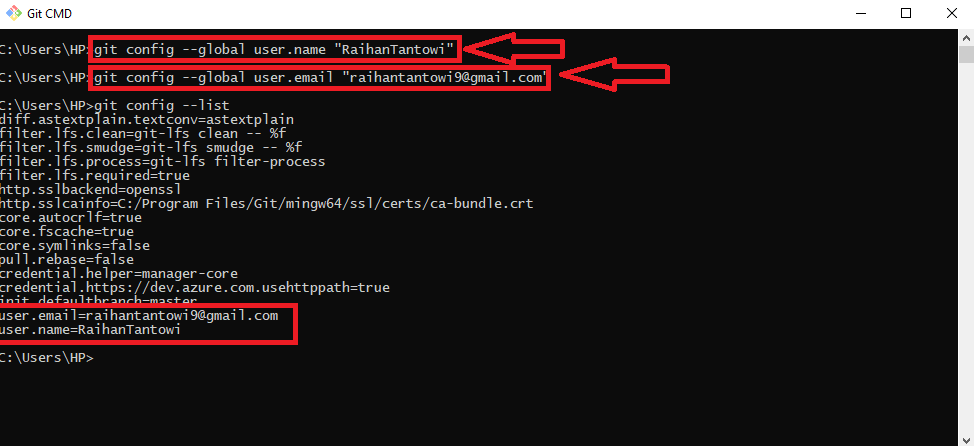
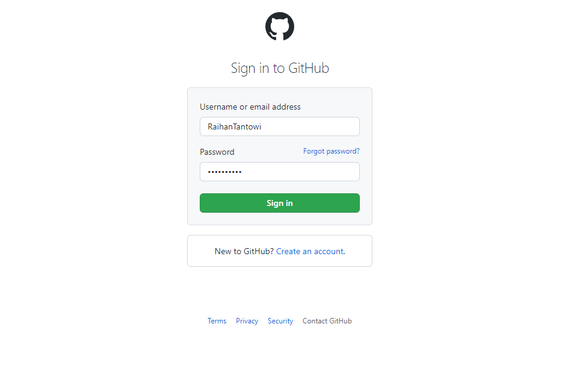
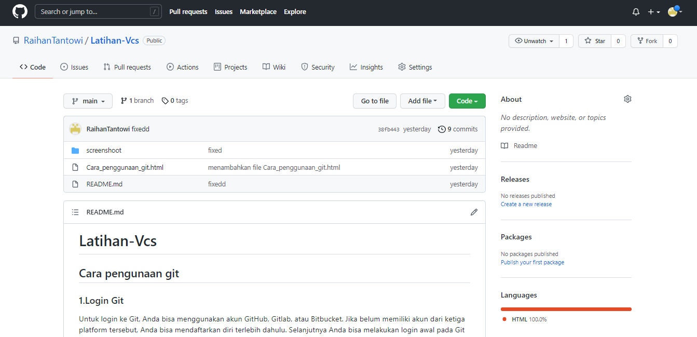
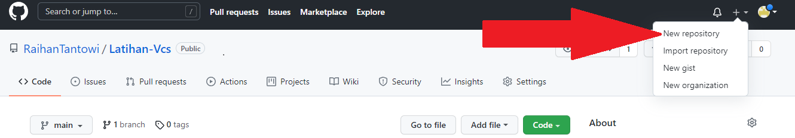
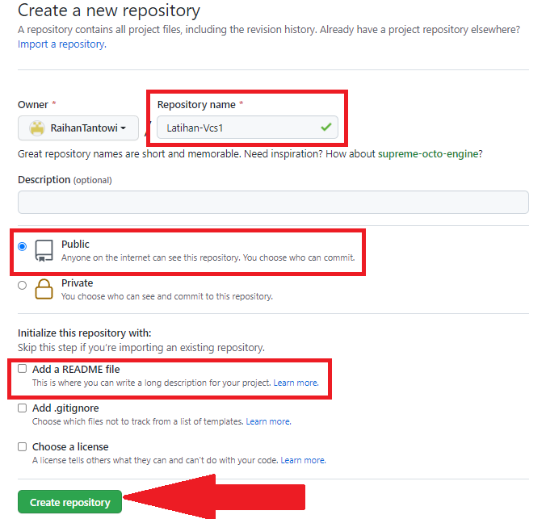
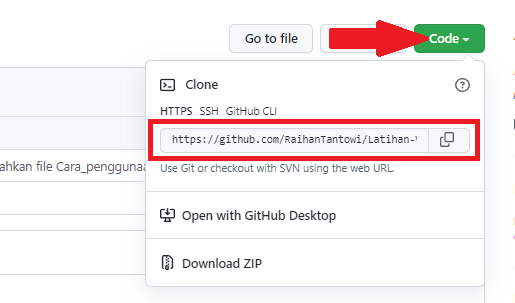
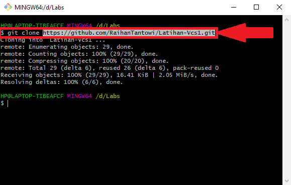
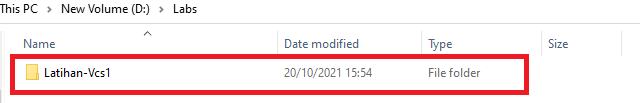

# Latihan-Vcs1
## Cara pengunaan git

### 1. Login Git
Untuk login ke Git, Anda bisa menggunakan akun GitHub, Gitlab, atau Bitbucket. Jika belum memiliki akun dari ketiga platform tersebut, Anda bisa mendaftarkan diri terlebih dahulu. Selanjutnya Anda bisa melakukan login awal pada Git  menggunakan Command Prompt  (Windows) atau Command Line (Linux) . Kemudian masukkan perintah-perintah yang akan kami jelaskan di bawah ini:

Selanjutnya, masukkan username GitHub Anda menggunakan perintah di bawah ini. Lalu tekan ENTER jika sudah benar.
$ git config --global user.name "UsernameAnda"

Kemudian masukkan email yang terdaftar di GitHub Anda menggunakan perintah di bawah  ini. Lalu tekan ENTER jika sudah benar.
$ git config --global user.email “IsiDenganEmailAnda@gmail.com”

Selanjutnya untuk memastikan proses login Anda berhasil, masukkan perintah berikut.
$ git config –list

 ### 2. Login GitHub
Langkah kedua dalam belajar menggunakan Git adalah Anda harus login ke dalam website GitHub. Github dan Git memiliki hubungan khusus, yaitu Git yang berperan sebagai version control system dan Github menjadi hosting atau sebagai penyimpan kode pemrograman. (jika belum memiliki akun github segera untuk daftar terlebih  dahulu).
 

Setelah anda login, maka akan muncul tampilan dashboard dari Github seperti gambar dibawah ini. 

### 3. Buat Repository
Setelah berhasil login ke Github, Anda bisa mulai membuat repository. Klik tombol New pada menu Repositories untuk membuat repository baru. 

Kemudian Anda akan diarahkan pada halaman untuk membuat repository baru seperti gambar dibawah ini.

Anda perlu mengisi detail informasi berikut:
* Nama Repository: digunakan untuk identitas repository yang dibuat.
* Deskripsi Repository: berfungsi untuk deskripsi dari repository yang dibuat.
* Jenis Repository: jenis repository dibagi menjadi Public dan Private. Ketika Anda mengatur repository menjadi Public, orang lain dapat melihat repository yang Anda buat. Sebaliknya, jika Anda mengaturnya sebagai Private, repository tersebut hanya bisa diakses oleh Anda. Setelah mengisi detail informasi di atas, klik Create Repository.

lalu salin code https repository yag telah kita buat di github.

 
### 4. Buat Folder pada Windows
Selanjutnya, Anda perlu membuat folder pada local disk komputer Anda. Fungsinya adalah untuk menyimpan update file dari repository GitHub yang telah Anda buat.
buat new folder dan tentukan folder, contoh: berlokasi di /d/Labs

### 5. Buka folder menggunakan Git Bash
Setelah berhasil membuat folder pada local disk komputer Anda, buka folder tersebut dengan cara klik kanan lalu pilih Git Bash Here.

Setelah itu, Command Prompt akan muncul seperti gambar di bawah ini. 
 

### 6. Buat Git Clone
Buat perintah git clone dan pastekan code https yang telah di copy tadi dengan menggunakan perintah (git clone). 

$ git clone https://github.com/RaihanTantowi/Latihan-Vcs.git lalu klik enter

perintah ini berguna untuk menambahkan repository yang ada di github ke local disk komputer.
Kemudian file repository yang ada pada github akan muncul secara otomatis ke local disk komputer, seperti gambar di bawah ini. 

5.Tambahkan File ke Repository
Untuk bisa menambahkan file ke repository GitHub, Anda perlu menerapkan langkah-langkah di bawah ini:

* Contohnya, disini kami membuat file Belajar_Html_Upb.html pada folder Latihan-Vcs1
* Buka GitBash pada folder Latihan-Vcs1 dengan cara klik kanan kursor.
* Setelah itu, Command Prompt akan muncul seperti gambar di bawah ini.
 
lalu masukkan perintah berikut:

$ git add Belajar_Html_Upb.html 
Perintah tersebut tidak akan menghasilkan output apa pun.

5.	Buat Commit 
Selanjutnya, Anda perlu membuat Commit.
 
Commit berfungsi untuk menambahkan update file serta komentar. Jadi setiap kontributor bisa memberikan konfirmasi update file di proyek yang sedang dikerjakan. Masukkan perintah berikut untuk membuat Commit:
$ git commit -m "Menambahkan file Belajar_Html_Upb.html"
Pada tutorial ini kami membuat “Menambahkan file Belajar_Html_Upb.html” sebagai Commit menambahkan file baru. Anda bebas membuat membuat nama Commit apa saja.

6.	Buat Git status 
Perintah git status menampilkan daftar file yang berubah Bersama dengan file yang ingin di tambahkan atau di-commit. Gunakan: git status

